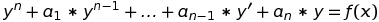
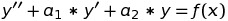
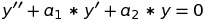
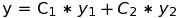
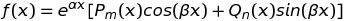
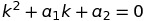
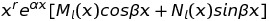
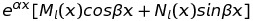

# Вопрос #13

## [Линейные неоднородные дифференциальные уравнения с постоянными коэффициентами и со специальной правой частью.](https://studfiles.net/preview/4397061/page:7/)

Линейным неоднородным дифференциальным уравнением (ЛНДУ) `n`-го порядка с постоянными коэффициентами называется уравнение вида 
 **_(1)_** 
где `ai`, `i=1..n` – действительные числа; `y = f(x)` – данная функция.

Рассмотрим ЛНДУ второго порядка 
 **_(2)_** 
и соответствующее ему однородное уравнение (ЛОДУ) 
 **_(3)_** 
Пусть `y1` и `y2` – фундаментальная система решений уравнения **_(3)_**, тогда 
 **_(4)_** 
есть общее решение уравнения **_(3)_**

### Теорема (о структуре общего решения ЛНДУ)

Общее решение неоднородного уравнения **_(2)_** равно сумме общего решения соответствующего однородного **_(3)_** и частного решения неоднородного уравнения **_(2)_**: 
`y_{он} = y_{оо} + y_{чн}` 
**Доказательство.** Так как `y_{оо}` - общее решение уравнения **_(3)_**, то по определению решения эта функция обращает уравнение **_(3)_** в верное равенство. Так какучн- частное решение уравнения **_(2)_**, то функция `у_{чн}` также обращает это уравнение в тождество. Имеем два тождества: 
`у''_{оо} + a1*y'_{оо} + a2*y_{оо} ≡ 0` 
`(y_{чн})'' + a1(y_{чн})'+ a2*y_{чн} ≡ f(x)` 
найдем их сумму: 
`(y''_{оо} + y''_{чн})+ a1(y'_{оо} + y'_{чн})+ a2(y_{оо} + y_{чн}) ≡ f(x)` или 
`(y_{оо} + y_{чн})''+ a1(y_{оо} + y_{чн})' + a2(yоо+yчн) ≡ f(x)` 
Следовательно, `y_{он} = y_{оо} + y_{чн}` является общим решением уравнения **_(2)_**.

### Нахождение частного решения ЛНДУ со специальной правой частью

В том случае, когда правая часть дифференциальных уравнений **_(1)_** и **_(2)_** в общем случае имеет вид 
 
где `Pm(x)` и `Qn(x)` - многочлены переменной `x` степеней `m` и `n`; `α, β` - действительные числа, используется метод неопределенных коэффициентов (или метод подбора). 
Частное решение `y_{чн}` дифференциального уравнения **_(2)_** зависит в каждом конкретном случае от вида функции `f(x)` и от выражения `α±iβ`(где i = sqrt(−1) ), которое сравнивается с корнями характеристического уравнения, составленного для соответствующего ЛОДУ **_(3)_**. Возможны случаи:

**1. Если `α±iβ` является корнем кратности `r` характеристического уравнения**  **_(5)_** (`r` – означает сколько раз `α±iβ` совпадет с корнями характеристического уравнения). Тогда частное решение находится в виде
`y_{чн}` =  
где `Ml(x)` и `Nl(x)` - многочлены со своими неопределенными коэффициентами, при этом `l = max{m, n}`.

**2. Если `α±iβ` не является корнем характеристического уравнения** **_(5)_**, то `r = 0` и `x0=1`, тогда частное решение `y_{чн}` имеет вид 
`y_{чн}` = 
