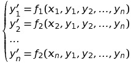

# Вопрос #15

## [Системы дифференциальных уравнений. Нормальные системы первого порядка.](https://studopedia.ru/9_168041_sistemi-differentsialnih-uravneniy.html)

**Определение.** Системой дифференциальных уравнений называется совокупность уравнений, в каждое из которых входит независимая переменная, искомые функции и их производные.

**Определение.** Нормальной системой дифференциальных уравнений называется система дифференциальных уравнений вида: 
 **_(1)_** 

Решением такой системы называется совокупность `n` функций `yi(x)`, `i=1..n`, удовлетворяющих всем уравнениям системы.

Частным решением системы **_(1)_** называется решение, удовлетворяющее заданным начальным условиям `yi(x0)=yi0` `i=1..n`, где `yi0` - заданные постоянные величины.

## [Редукция одного уравнения высшего порядка к нормальной системе первого порядка.](http://sdamzavas.net/2-61013.html)

Рассмотрим задачу Коши для дифференциального уравнения `n`-го порядка: 
 **_(2)_** 
 **_(3)_** 
Если уравнение **_(2)_** разрешимо относительно старшей производной un, т.е. его можно представить в виде ,то его можно привести к нормальной системе n дифференциальных уравнений. Положим: 
 
Уравнение **_(2)_** тогда примет вид: 
 
Таким образом, наше уравнение свелось к нормальной системе СДУ: 
 
Начальные условия **_(3)_** принимают следующий вид: 

