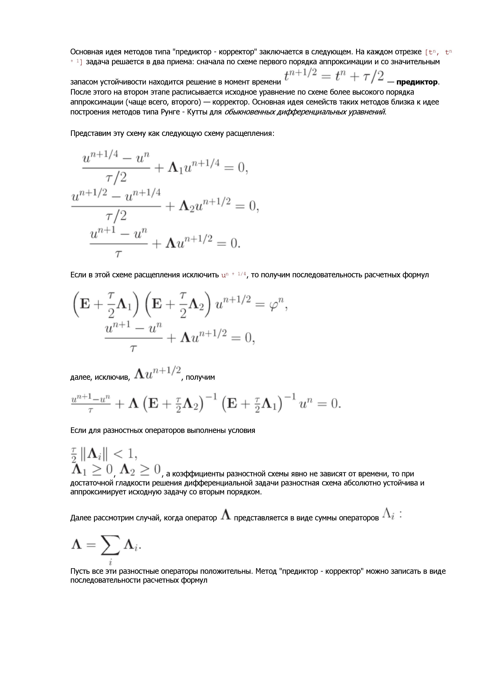
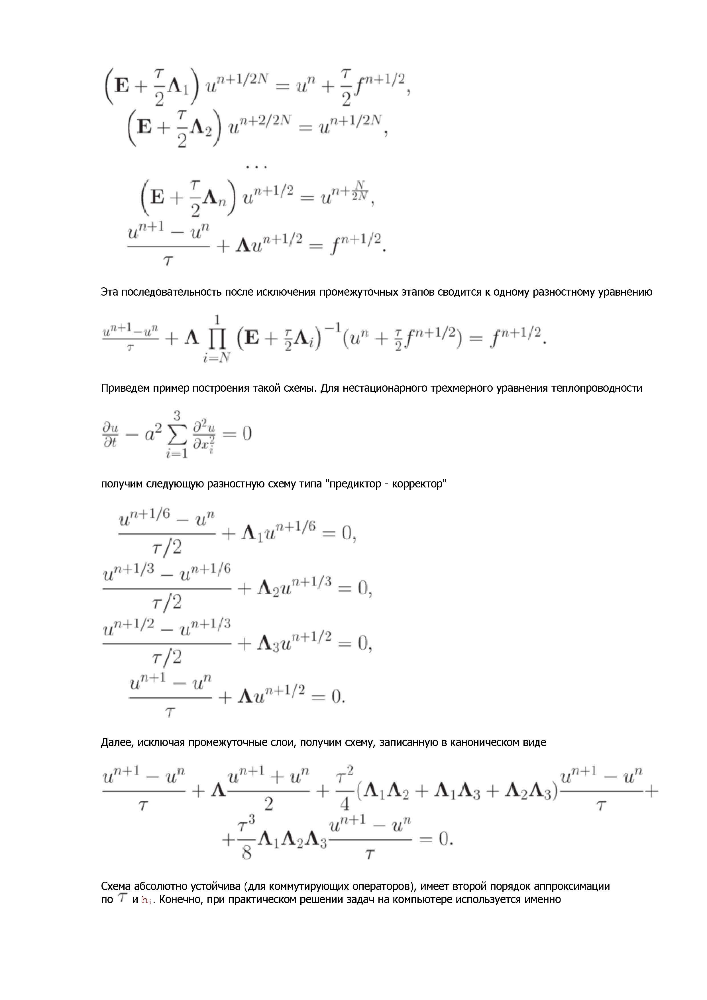
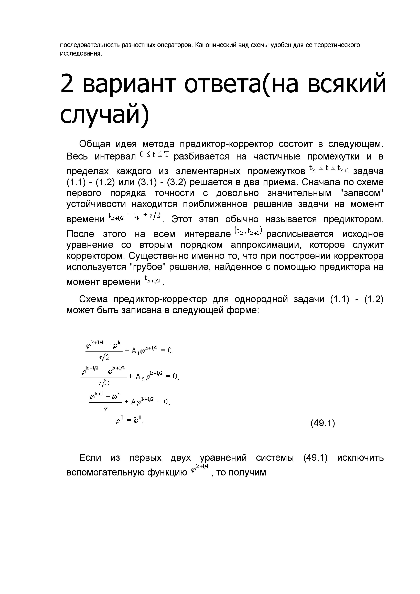
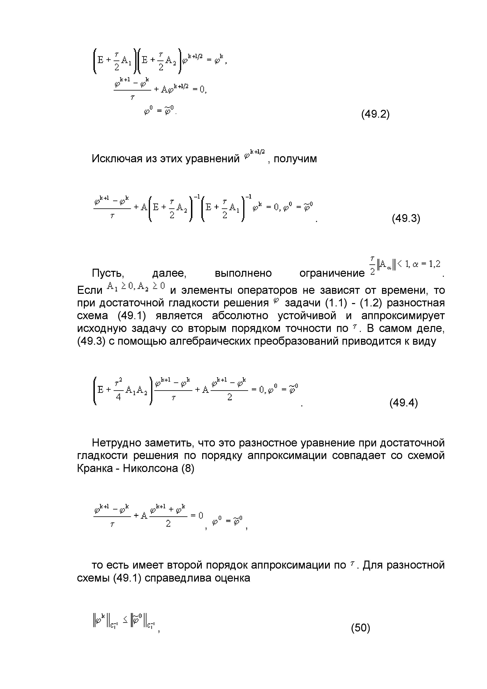
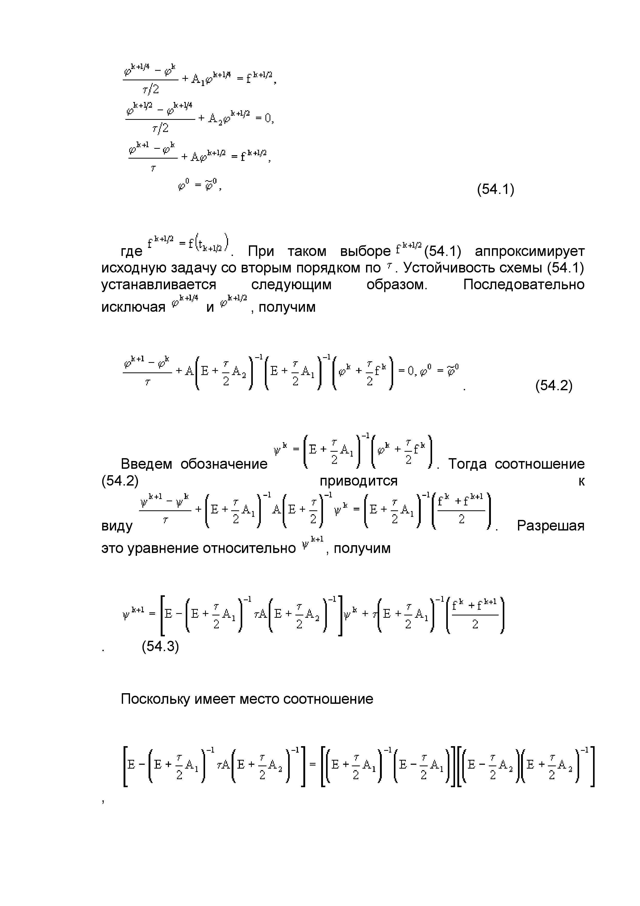
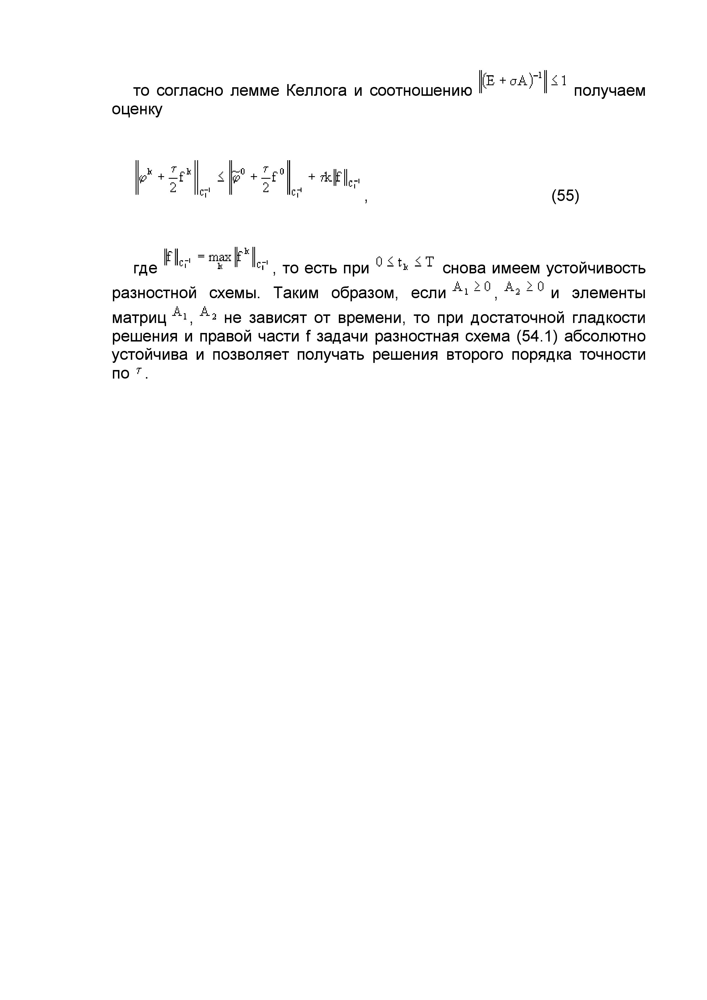
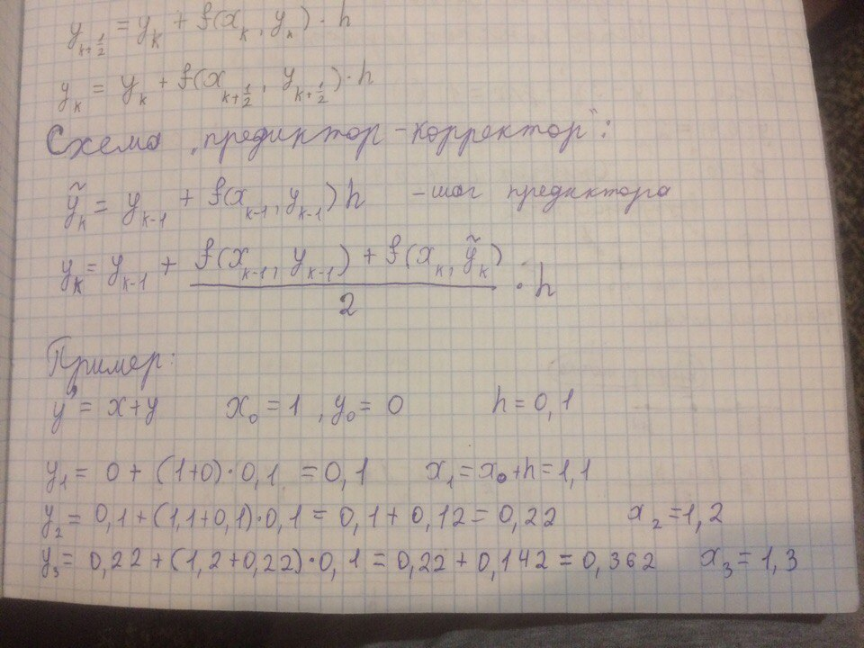
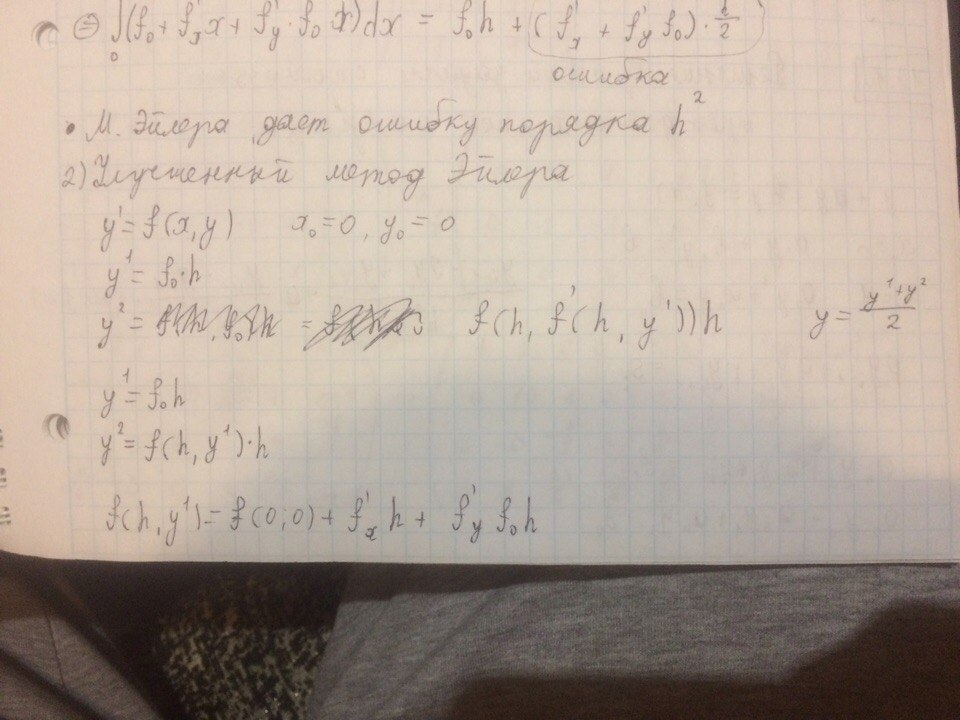
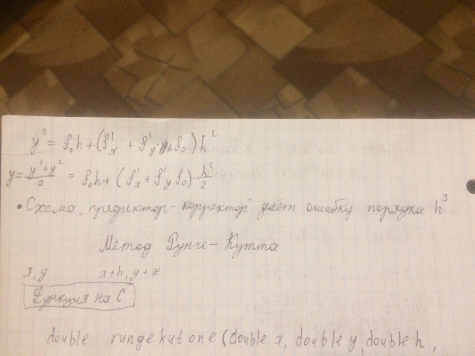

# Вопрос #19

## [Схема предиктор–корректор для одного уравнения 1-го порядка](http://detc.ls.urfu.ru/assets/amath0031/lectures/predictor_ru.html)

 
 
 
 
 
 
 

## Схема предиктор–корректор для одного уравнения 1-го порядка (вариант #2)

 

### Оценка точности

 
 
