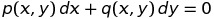

# Вопрос #5

## [Уравнения с интегрирующим множителем](http://1cov-edu.ru/differentsialnye-uravneniya/integriruyuschii_mnozhitel/)

**Интегрирующий множитель M(x, y)** это такая функция от переменных `x` и `y`, умножив на которую, дифференциальное уравнение первого порядка

становится уравнением в полных дифференциалах:

.png)

### Свойства интегрирующего множителя

Рассмотрим дифференциальное уравнение:

.png) **_(1)_**

Если

.png)

То левая часть уравнения **_(1)_** не является дифференциалом некоторой функции. Однако при выполнении условий существования единственного решения уравнения **_(1)_**, его можно привести к уравнению в полных дифференциалах умножением на некоторую функцию `M(x,y)` от переменных `x` и `y`.

.png)

**Дифференциальное уравнение первого порядка имеет бесконечное число интегрирующих множителей** (при выполнении условий существования единственного решения).

Доказательство:

Если существует решение уравнения **_(1)_**, то его общий интеграл можно представить в виде: .png)

Возьмем дифференциал:

.png) **_(2)_**

Отсюда:

.png)

С другой стороны, из уравнения **_(1)_**:

.png)

Левые части уравнений равны. Поэтому равны правые части:

.png)

Или:

.png)

Тогда уравнение **_(2)_** можно переписать в виде:

.png)

Исходное уравнение **_(1)_** превратилось в полный дифференциал умножением на интегрирующий множитель:

.png)

что доказывает существование интегрирующего множителя.

Покажем, что существует бесконечно много интегрирующих множителей. Для этого выражение:

.png)

Умножим на произвольную функцию .png) от .png):

.png)

Это выражение также является полным дифференциалом, поэтому множитель

.png)

также является интегрирующим множителем. Поскольку .png) – это произвольная функция, то можно построить бесконечное число интегрирующих множителей.

**Если известны два интегрирующих множителя, отношение которых не является постоянной, то их отношение является общим интегралом дифференциального уравнения:**

.png)

Действительно, поскольку .png) , то

.png)

Но, поскольку, .png) – общий интеграл уравнения, то

.png)

Отсюда:

.png)

### Методы определения интегрирующего множителя

#### Метод последовательного выделения дифференциала

Этот метод аналогичен методу выделения полного дифференциала для уравнений в полных дифференциалах. Только здесь полный дифференциал удается выделить, умножая уравнение на множители. Для этого применяем формулы дифференцирования, записанные в дифференциальной форме:

.png)

В этих формулах `u` и `v` - произвольные выражения, составленные из любых комбинаций переменных.

#### Метод группировки членов уравнения

Если сразу найти интегрирующий множитель не удается, то можно попытаться сгруппировать члены уравнения. Пусть мы имеем уравнение:

.png)

разбиваем его на сумму слагаемых:

.png)

Пусть первое слагаемое имеет интегрирующий множитель:

.png)

Умножаем уравнение на `M1`:

.png)

Далее следует подобрать такую функцию .png) от `U1` чтобы при умножении на нее, второе слагаемое стало полным дифференциалом:

.png)

Первое слагаемое при этом остается полным дифференциалом:

.png)

Тогда:

.png)

Далее следует подобрать такую функцию .png) от .png), чтобы при умножении на нее, следующее слагаемое стало полным дифференциалом. И так далее, пока все выражение не станет полным дифференциалом.

#### Определение интегрирующего множителя заданного вида

Пусть имеется уравнение

.png)

для которого ищется интегрирующий множитель вида

.png)

где `u=u(x,y)` – заданная функция от переменных `x` и `y`.

Найдем такой интегрирующий множитель, или определим, что множителя такого вида не существует. Для этого умножим исходное уравнение на `M`:

.png)

Это уравнение будет уравнением в полных дифференциалах при выполнении условия

.png)

Или:

.png)

Теперь положим, что `M` – это функция от `u`, где `u=u(x,y)` – это заданная функция переменных `x` и `y`. Тогда

.png)

Подставляем:

.png)

Отсюда:

.png) **_(3)_**

Левая часть этого уравнения является функцией от `u`. Поэтому и правая часть тоже должна быть функцией от `u`.

Таким образом, **интегрирующий множитель заданного вида существует, если правая часть уравнения _(3)_ является функцией от `u`**:

.png)

В этом случае

.png)

Или

.png)

Интегрируем:

.png)

Отсюда

.png)

Поскольку постоянная `C` для интегрирующего множителя никакого значения не имеет, положим `C=1`:

.png)
